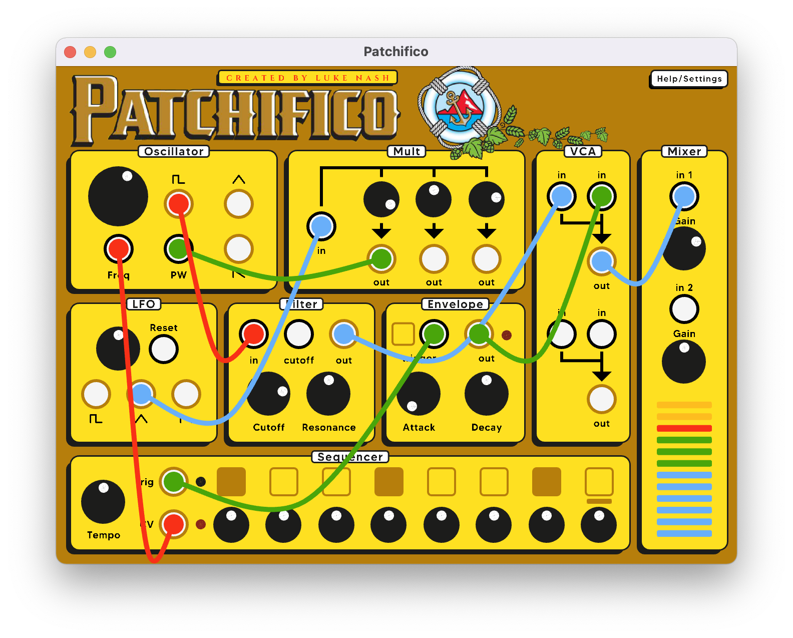

# Patchifico

Patchifico is a virtual modular synthesizer themed around Pacifico beer. The patchable interface is inspired by VCV Rack, and the synth engine (in particular the sequencer) is inspired by the Moog DFAM.



## Dependencies
This project makes use of raylib and miniaudio, two absolutely wonderful libraries.

## Building instructions
So far, building this project has only been tested on MacOS using the following commands:
```
cmake -DCMAKE_BUILD_TYPE=DEBUG -S . -B build
cmake --build build
```

-DCMAKE_TOOLCHAIN_FILE=/Users/lukenash/Documents/Github/emsdk/upstream/emscripten/cmake/Modules/Platform/Emscripten.cmake
-DPLATFORM=Web

-DMA_ENABLE_AUDIO_WORKLETS  // -sAUDIO_WORKLET=1 -sWASM_WORKERS=1 -sASYNCIFY 

emcmake cmake -DCMAKE_BUILD_TYPE=DEBUG -DCMAKE_TOOLCHAIN_FILE=/Users/lukenash/Documents/Github/emsdk/upstream/emscripten/cmake/Modules/Platform/Emscripten.cmake -S . -B build